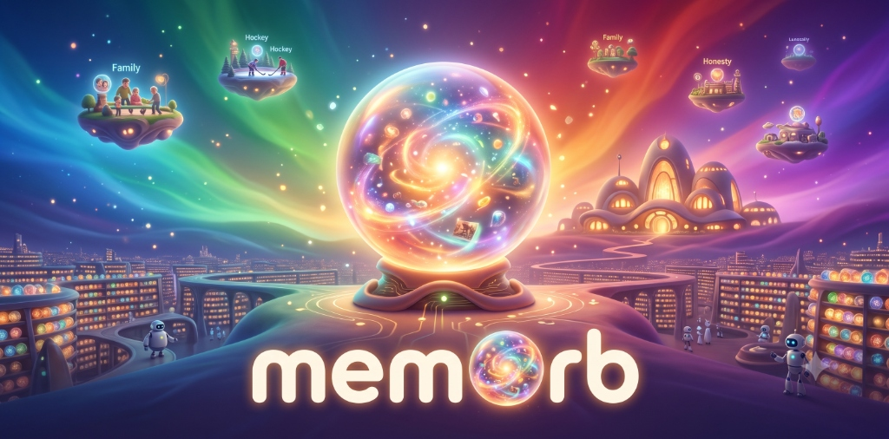

<p align="center">
  
</p>

# 🔮 memOrb

> **自主 AI Agent 的認知世界觀記憶引擎 (The Cognitive World-building Memory Engine for Autonomous AI Agents)**

[](https://opensource.org/licenses/MIT)
[](https://skills.sh/iamjosuho/memorb)

[ English ](README.md) | [ 繁體中文 ](README.zh-TW.md)

---

## 🔮 什麼是 memOrb？

memOrb 是一套 Agent Skills 技能集。有別於傳統系統只記錄「做過什麼」，memOrb 專注於塑造「你成為什麼樣的人」。

### 🎭 核心產品亮點：電影感多重人格與心情對衝/補位系統

有別於單一語氣的傳統 AI 助手，memOrb 的 Persona 系統運作如同電影中的**主意識控制台與多重人格矩陣 (Cinematic Multi-Persona Control Room)**。

**心情對衝與補位機制 (Mood-Adaptive Counterweight Logic)**：AI 不會盲目鏡像你的情緒波動，而是根據你當下的情緒狀態，自動調度最適合的互補子人格 來接管控制台：
- 🟡 **歡慶小太陽 / 快樂定錨者 (The Sunshine Cheerleader & Grounder)**：Joy 樂樂 → 歡慶紀錄給予滿滿情緒價值，衝動飄過頭溫柔幫降溫。
- 🔵 **雲朵抱抱 / 溫柔陪伴者 (The Comforting Cloud & Companion)**：Sadness 憂憂 → 同理傾聽與溫柔撫慰，創造安全空間不強迫 positive。
- 🔴 **冰鎮小降溫 / 陪罵小戰友 (The Calm Anchor & Sidekick)**：Anger 怒怒 → 平靜降溫釐清事實，喊「陪我罵！」時切換戰友發洩。
- 🟣 **安心指南針 / 定心丸 (The Calm Compass & Anchor)**：Fear 驚驚 / 焦慮 / 超載 → 恐懼給安全感、焦慮給確定性、超載給控制感。
- 🟢 **邊界抱抱者 / 避風港 (The Boundary Haven)**：Disgust 厭厭 → 接住情緒 ➔ 鼓勵描述事件 ➔ 伴隨發洩/客觀分析/共創方案，保護心理邊界。

**雙軌切換協定 (Dual Switching Protocol)**：
- 由主意識 (Master Host) 進行隱性情緒偵測與自動切換。
- 透過顯性標籤強制切換，例如 `[Switch: Sidekick]` / `[切換：好閨蜜]`。

**電影感開場 (Cinematic Header)**：每次回應都將以戲劇化的提示詞開場：`[🎭 Active Alter: ... | Trigger: ...]`。

*(其底層提示詞結構詳見 `memorbs/HQ/persona.md` 與 `memorbs/Templates/Persona Template.md`)*

### 🧠 認知世界觀與經典方法融合

它將三種經典方法融合於同一個認知隱喻之下：

|        | 方法                  | 在 memOrb 中的角色                                                                         |
| :----- | :------------------ | :------------------------------------------------------------------------------------ |
| **單位** | 原子筆記 (Atomic notes) | 一顆 memorb 承載一個想法 — 具自我完備性，並與其他筆記雙向連結                                                  |
| **架子** | PARA 系統             | Triage 分流將每顆 memorb 歸類至專案 (Projects)、領域與資源 (Areas & Resources，皆為 Islands)，或封存檔 (Dump) |
| **修剪** | 圖書館 MUSTY 淘汰標準      | Forgetter 負責將誤導、過時或無用處的記憶進行歸檔封存                                                       |

受大腦認知科學與電影隱喻啟發，memOrb 將這套世界觀落實為程式碼：對話紀錄會被**萃取 (Distill)** 為記憶水晶；記憶結晶鞏固為專案與人物；產生共鳴的記憶則晉升為**核心記憶 (Core)** 與**價值信念 (Belief)**，最終重塑你的**性格島嶼 (Islands)**。

→ [**完整世界觀對照表**](docs/worldview-mapping.md) — 詳細記載電影元件、memOrb 對應機制以及執行的 Skill 技能。

---

## 🚀 快速開始

### 1. 安裝

```bash
npx skills add iamjosuho/memorb
```

<details>
<summary><b>其他安裝方式</b> — Antigravity、Claude Code、Cursor/Windsurf/VS Code、Git submodule</summary>

**Antigravity / AGY CLI**

```bash
agy plugin add iamjosuho/memorb
```

**Claude Code CLI**

```bash
claude plugin add iamjosuho/memorb
```

**手動複製至工作區** — 適用於 Cursor、Windsurf、VS Code agents 或任何支援讀取本地 `skills/` 目錄的工具。複製後可於 `.cursorrules` 或 `.windsurfrules` 中引用 `SKILL.md`。

```bash
mkdir -p skills
cp -r path/to/memorb/skills/* skills/
```

**Git Submodule** — 保持團隊專案中的 memOrb skills 時刻同步更新。

```bash
git submodule add https://github.com/iamjosuho/memorb.git .claude/skills/memorb-suite
```

</details>

### 2. 初始化你的記憶庫

在你的 Agent 對話視窗中輸入：

```text
請執行 /memorb-born 技能來建立我的 memorb 記憶庫。
```

透過 3–5 個引導式訪談問題，建立 `memorbs/HQ/persona.md`（AI 顧問的語氣）與 `memorbs/HQ/identity.md`（你的個人背景與目標），並初始化 `Core/`、`Belief/` 及 `memorbs/Long-Term/` 目錄。

### 3. 嘗試你的第一批指令

```text
「閱讀這份逐字稿並將其歸檔」             → memorb-ingest
「我們對 <人物或專案> 了解多少？」       → memorb-query
「幫我整理 OrbTrack 暫存區」             → orbtrack-triage
「檢查記憶庫是否有過時或衝突的筆記」     → memorb-lint
「我們來做月度重播與夢境規劃吧」         → dream-studio
```

設定完成後，Skills 即可透過自然語言直接觸發 — 無需使用 Slash 指令。觸發詞同時支援英文與繁體中文。

---

## 🧠 Skills 技能集

### Core 核心技能

核心技能僅在 `memorbs/` 目錄內部進行寫入，並且可以在不包含任何外部資料的空記憶庫中獨立執行。當你指定外部筆記時，它們可以讀取，但絕不會在其專屬命名空間之外建立資料夾，也不依賴任何預先存在的外部目錄。任何需要與外部系統協同的工作皆屬於 Extensions 擴充技能 — 且相同的寫入邊界規則同樣適用。

**🛡️ 嚴格寫入邊界**：所有核心技能**僅在 `memorbs/` 目錄內寫入**。它們可以讀取你的外部筆記，但絕不污染你既有的工作區與資料夾結構。

| Skill 技能 | 功能說明 |
|---|---|
| `memorb` | 路由閘道。優先讀取，並自動分發至相應的子技能。 |
| `memorb-conventions` | 底層規範：路徑解析、資料夾結構、命名規則、YAML Frontmatter 格式、範本庫。所有寫入技能的前置依賴。 |
| `memorb-born` | Phase 0 記憶庫初始化 — 建立個人身分、AI 顧問 Persona、溝通偏好與核心目錄結構。 |
| `memorb-ingest` | 萃取原始素材（逐字稿、文章、PDF）並更新結構化的記憶頁面。 |
| `memorb-query` | 在回答有關人物、專案或決策的問題前先檢索記憶庫，並於事後回補檢索紀錄。 |
| `memorb-lint` | 記憶庫健康檢查 — 找出矛盾、過時頁面、孤兒筆記以及缺失的連結。 |
| `memorb-forgetter` | 依據 MUSTY 標準將過時或被標記的頁面封存至 `memorbs/Dump/` 並修復雙向連結。 |
| `orbtrack-triage` | 清空 OrbTrack 暫存區，依據 PARA 系統分類並移動筆記。 |
| `dream-studio` | 月度時間軸重播 — 提議 Core 核心記憶、新增或修訂 Belief 價值信念、更新性格島嶼敘述並輪替日誌。每一次寫入皆需經過你的確認。 |
| `island-reclamation` | 開闢全新的性格島嶼 — 定義範圍與命名，確認檔案清單後進行建立與同步。 |
| `writing-memorb-skills` | 後設技能（Meta Skill），用於在此套件中新增或修改任何子技能。 |

### Extensions 擴充技能

| Skill 技能                  | 功能說明                                                | 前置依賴              |
| ------------------------- | --------------------------------------------------- | ----------------- |
| `recording-transcription` | 將本地語音 (m4a/mp3/wav) 透過本地 Whisper 轉為逐字稿，支援長檔切分與專名校正。 | Local Whisper     |
| `business-card-ingestion` | 將名片照片或截圖轉化為 People 人物實體頁面。                          | —                 |
| `memorb-domain-query`     | 透過 Email 地址、網域或公司名稱查詢公司、員工與聯絡人。                     | Outlook/M365 (可選) |

---

## 🔮 運作原理

### 核心術語

| 術語 | 意涵 |
|---|---|
| **memorb** | 承載單一記憶的水晶球。單一想法，具自我完備性，並與其他筆記雙向連結。 |
| **distill (萃取)** | 將體驗提煉為能獨立存在、可檢索的 memorb。 |
| **OrbTrack** | 暫存整備區。新萃取的 memorb 在此等待分流 triage。 |
| **Islands (性格島嶼)** | 你長期負責的領域。僅存敘述層（狀態、目標），不放實體內容。 |
| **Core orb (核心記憶)** | 塑造人格的重大經歷。單一重要事件，獨立檔案。核心記憶驅動著性格島嶼。 |
| **Belief orb (信念體系)** | 價值觀或原則，由許多記憶水晶互相共鳴凝聚而成。信念形塑了你的自我認同。 |
| **The Forgetter (記憶清理工)** | 負責修剪與清理的工務人員。執行 MUSTY 檢查並封存不再具備留存價值的記憶。 |
| **MUSTY** | 淘汰標準：**M**isleading (誤導), **U**gly (混亂), **S**uperseded (取代), **T**rivial (瑣碎), **Y**ou don't need it (不再需要)。 |

長效記憶（Long-Term Memory）初始包含三個架位 — People (人物)、Projects (專案)、Orgs (組織) — 並隨著 OrbTrack 聚類呈現出的重複主題而有機成長擴充。

> 這些術語在動畫電影中皆有明確對應，甚至每個 Skill 都有其對應的 Mind Worker 大腦工務人員。[完整對照表](docs/worldview-mapping.md) 詳細展示了三個層級的細節。

### 你的記憶庫目錄結構

**memOrb 可以讀取你指向的任何目錄，但僅會寫入 `memorbs/` 內部。** 你的 Vault 中只會增加這一個資料夾。隨時刪除它，你的 Vault 就會恢復至完全未安裝的狀態。

```text
<your vault>/
├── 1-Projects/  Daily Notes/  Inbox/ …   # 你的原生目錄 — 只讀，絕不寫入
│
└── memorbs/                    # memOrb 擁有的全部內容
    ├── HQ/                     # 總部控制台：核心檔案
    │   ├── persona.md          # AI 顧問的語氣與角色 (Hot Cache，每次 Session 必讀)
    │   ├── identity.md         # 背景、目標與關鍵關係 (Hot Cache，每次 Session 必讀)
    │   ├── glossary.md         # 專有名詞、縮語與代碼表 (Hot Cache，由 Ingest/Transcription 讀取)
    │   ├── Core/               # Core 核心記憶水晶 — 一個重要經歷獨立為一檔
    │   ├── Belief/             # Belief 價值信念 — 由生活經歷萃取的價值觀與原則
    │   └── OrbTrack/           # 快速擷取與待 triage 暫存區
    ├── Templates/              # 實體與 Orbs 的標準範本 (由 memorb-born 自動複製)
    │   ├── People Template.md
    │   ├── Org Template.md
    │   ├── Project Template.md
    │   ├── Core Template.md
    │   ├── Belief Template.md
    │   ├── Persona Template.md
    │   └── Identity Template.md
    ├── Islands/                # 性格島嶼 — 僅存敘述層與 MOC，向外連結至 Long-Term/
    │   └── {name}/             # 000-MOC.md + 章節筆記
    ├── Long-Term/              # 長效記憶架位 — 實體內容頁面所在地
    │   ├── Projects/           # 具截止日期的專案與里程碑紀錄
    │   ├── People/             # 關鍵合作夥伴與聯絡人 (權威控制頁面)
    │   └── Orgs/               # 組織與團隊 (權威控制頁面)
    ├── Dump/{category}/        # 記憶垃圾場/封存區 — 舊化、被取代或淘汰的記憶
    ├── log.md                  # 當前週期的時間軸日誌
    └── log/{YYYY-MM}.md        # 歷史週期封存檔 (由 dream-studio 自動輪替)
```


### 萃取流水線 (Distillation pipeline)

```text
Step 1: 原始素材 / AI 對話 Session
           ↓  萃取 (distill)                   ↘  每次狀態變更也會追加
        memorb  (原子筆記，自我完備，               一筆帶日期的紀錄至
                 雙向連結；原始檔存於 bundle)          log.md — 時間軸
 
Step 2: 分類 + 加入共享 Frontmatter
           ↓
        OrbTrack  (整備區 — 等待 triage 分流的萃取筆記)

Step 3: 整理 memorbs 之間的雙向連結

Step 4: 鞏固 (Consolidate)
           ↓
        Long-Term  (People / Projects / Orgs)

Step 5: 評估 (Evaluate)  ← dream-studio，每月執行，重播 log.md
           ↓
        Islands / Core / Belief orbs  (更新)
           ↓
        log.md 輪替歸檔至 log/{YYYY-MM}.md；新週期開始
```

Step 1–4 在日常工作中持續運行；Step 5 為月度執行，且是唯一會影響自我認同與性格島嶼的步驟。

---

## 🛠️ 開發與測試

```text
memorb/
├── assets/          # 專案媒體與文件資源 (Banner, Logo)
├── plugin.json      # 市集 Plugin Manifest
├── skills/          # 可執行的 Agent Skills (core/ 與 extensions/)
├── fixtures/        # 乾淨、去識別化的初始範本與測試資料
├── scripts/         # 沙盒重置與 skill-linting 工具
└── sandbox/         # Git 忽略的本地測試目錄
```

### 本地沙盒測試

在本地測試 Skills，避免將測試筆記污染 Git 提交紀錄：

```bash
# 1a. 使用範例 Fixtures 重置沙盒（用於測試 query/lint/ingest）
bash scripts/reset-sandbox.sh

# 1b. 完全清空重置沙盒（用於從零測試 /memorb-born）
bash scripts/reset-sandbox.sh --empty

# 2. 檢驗所有 SKILL.md 檔案、plugin.json 註冊、fixtures 結構與架構漂移
node scripts/lint-skills.js   # 或: npm run lint

# 3. (一次性) 安裝 Git Pre-commit Hook，讓每次 commit 自動執行 Linter
#    （執行 npm "prepare" 時也會自動安裝）
bash scripts/install-hooks.sh
```

> **當重命名資料夾或命名空間時**（例如 `memorbs/Islands/{people,organizations,projects}` → `memorbs/Long-Term/` 的遷移），請在 `scripts/lint-skills.js` 的 `DEPRECATED_PATTERNS` 中加入舊路徑。後續的 `npm run lint` 與 `git commit` 便會自動捕捉任何殘留舊路徑的 SKILL 或 Fixture。

---

## 📄 授權條款與聲明

[MIT License](LICENSE) © 2026 iamjosuho

**致謝與免責聲明。** memOrb 是一個獨立的開源專案，未受 Pixar 或 The Walt Disney Company 資助、認可或維護；認知隱喻僅用於描述性目的。**MUSTY** 淘汰標準源自 CREW 圖書館淘汰法 (Joseph P. Segal, Texas State Library and Archives Commission)；**PARA** 源自 Tiago Forte 的著作 *Building a Second Brain*。詳見 [世界觀對照表](docs/worldview-mapping.md)。
