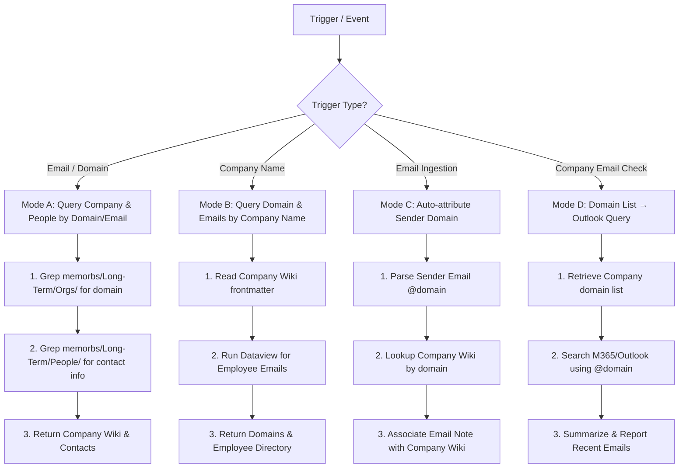

# 🌐 Memory Domain Query & Email Integration

## Overview

Bi-directional query workflow connecting **Email Addresses**, **Domains**, and **Company Wikis** in Second Brain, integrated with Outlook/M365 email operations.

Core Principle: **Domain is the primary digital identifier linking company wikis (`memorbs/Long-Term/Orgs/`), employee profile notes (`memorbs/Long-Term/People/`), and external email systems (M365/Outlook).**

---

## When to Use

Trigger this skill when:
- User provides an email address (e.g., `user@example.com`) to identify the owner or company.
- User provides a domain (e.g., `acme.com`), asking for associated company records and contacts.
- User asks for a company's domains and employee contact list.
- **Outlook/M365 Email Ingestion**: Categorizing incoming emails based on sender domain.
- **Company Email Status Checks**: User asks "Are there any new emails from [Company Name]?"

---

## 🔍 Workflows



### Mode A: Email / Domain → Company & People

1. **Search Company Wiki Domain**:
   Search `memorbs/Long-Term/Orgs/` for YAML `domain` array or body references:
   ```bash
   grep -ri "domain:.*acme.com" "$VAULT/memorbs/Long-Term/Orgs/" --include="*.md"
   ```
2. **Search Employee Profile Notes**:
   Search `memorbs/Long-Term/People/` for `contactChannels.email` or inline domain references:
   ```bash
   grep -ri "acme.com" "$VAULT/memorbs/Long-Term/People/" --include="*.md"
   ```
3. **Output**: Return matched Company Wiki link, company background, and list of associated personnel.

---

### Mode B: Company Name → Domains & Emails

1. **Locate Company Wiki**:
   Open target note (e.g., `memorbs/Long-Term/Orgs/12345678-Acme-Corp.md`).
2. **Extract `domain` Array**:
   Read `domain` frontmatter field (e.g., `[acme.com, acme.org]`).
3. **Query Employee Directory**:
   Run Dataview or Grep to aggregate employee emails:
   ```dataview
   TABLE title AS "Title", contactChannels.email AS "Email", domain AS "Domain"
   FROM "memorbs/Long-Term/People"
   WHERE (company = [[12345678-Acme-Corp]] OR contains(file.folder, "memorbs/Long-Term/People/Acme"))
   WHERE relationshipType != null OR contains(tags, "people")
   ```

---

### Mode C: Outlook/M365 Email Ingestion Attribution

1. Upon receiving an external email or daily ingestion, extract sender email (`sender_email = "jane.doe@acme.com"`).
2. Parse sender domain (`domain = "acme.com"`).
3. Search `memorbs/Long-Term/Orgs/` where `domain` contains `acme.com`.
4. Associate email summary with matched Company Wiki and Person Note.

---

### Mode D: Querying Recent Emails for a Company

1. User prompt: "Are there any new emails from Acme Corp?"
2. **Step 1 (Vault Lookup)**: Retrieve Acme Corp's `domain` array (`[acme.com, acme.org]`).
3. **Step 2 (Outlook Query)**: Execute Outlook/M365 query with filter `from:acme.com OR from:acme.org`.
4. **Step 3 (Report)**: Summarize latest email subject, sender, timestamp, and key action items.

---

## 📌 Dataview Reference Template

To embed an employee directory in a Company Wiki note:

```dataview
TABLE title AS "Title", contactChannels.email AS "Email", department AS "Department"
FROM "memorbs/Long-Term/People"
WHERE (company = [[12345678-Acme-Corp]] OR contains(string(company), "Acme") OR contains(file.folder, "memorbs/Long-Term/People/Acme"))
WHERE (relationshipType != null OR contains(tags, "people")) AND !contains(file.name, "Interview") AND !contains(file.name, "Review")
SORT department ASC
```

---

## Common Mistakes & Red Flags

| Anti-Pattern | Correct Approach |
|---|---|
| String comparison failure on domain | YAML `domain` is an array. Use `contains(string(domain), "domain.com")` in Dataview |
| Missing `contactChannels.email` | Check both YAML frontmatter and note body for email addresses |
| Querying emails by employee name | Always query Outlook by full domain list (`from:domain.com`) to catch new contacts |
